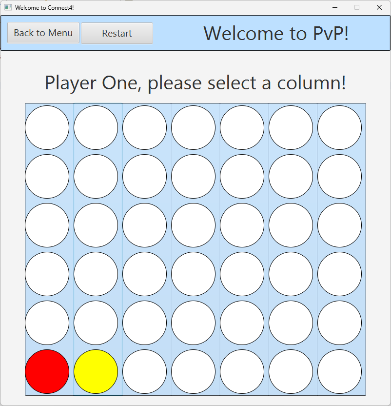
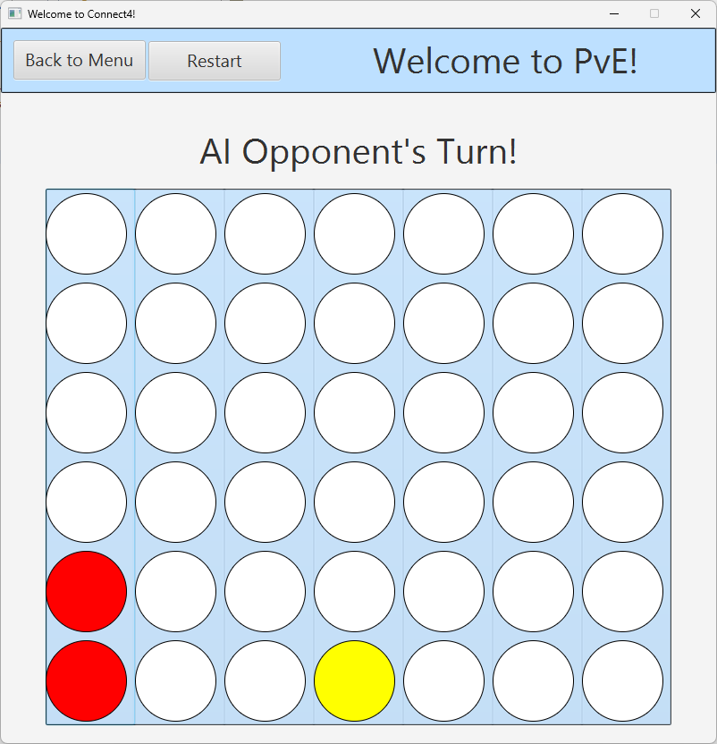
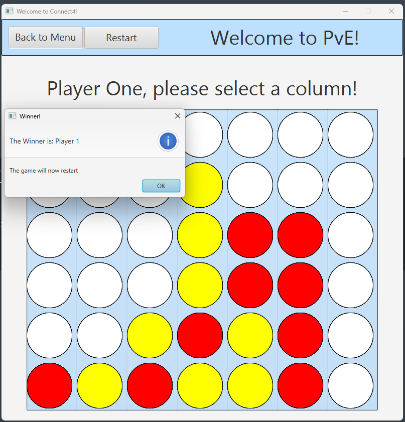

# Game Playing with Monte-Carlo Tree Search

The primary aim of this project is to design and implement a game-playing program using the Monte-Carlo Tree Search (MCTS) algorithm.  
The AI opponent will play Connect4 against real players, it will showcase the decision-making capabilities of the algorithm well and be a good opponent, demonstrating the algorithms effective use in AI gaming.

## Proof of Concepts

Early objectives include creating proof-of-concept programs. 
One of these will be the bandit proof of concept where I will create a bandit problem and then code four different ways of solving the bandit problem using four different algorithms. I will then run a series of tests and compare the results of the different algorithms to see which one is best, the best one being used in my implementation of MCTS.  
Another proof of concept is a basic Connect4 game that allows two human players to play the game. This will later be implemented into the final program, adding GUI and a player vs AI mode.  

## Main Features

- Proof of Concept: Implementation of Bandit Problem Solver:  
The project will commence with the development of a proof-of-concept program to tackle bandit problems, assessing the effectiveness of Upper Confidence Bound (UCB) methods against naive strategies. This will later be implemented into the Monte-Carlo Tree Search algorithm.  
-  Proof of Concept: Implementation of PvP Connect4:
Create a functional program allowing two players to play Connect4 without AI involvement. This will lay out the foundations for understanding game mechanics and state transitions.  
-  Game Rules Documentation:  
Formulate semi-formal documentation detailing the rules of Connect4, including state representations and allowable transitions. This ensures clarity in the game design.  
- 	GUI for Connect4:  
Designing and implementing GUI using JavaFX and SceneBuilder for Connect4. Creating a menu allowing users to pick between player vs player or to play vs AI. Provide documentation and justification for design choices.  
- 	Development of MCTS Algorithm:  
Implement the MCTS algorithm, encapsulating its core components, selection, expansion, simulation, and backpropagation, within a well-structured, object-oriented design.  
- 	Software Engineering Documentation:  
Compile a comprehensive report detailing the software engineering process, design decisions, and challenges faced during development. This will include discussions on the theoretical foundations of bandit processes and MCTS, as well as justifications for the GUI design.  

## Screenshots
Main Menu where the user can select to play against another player or against the AI  
  
Game playing screen where users can play against each other  
  
Game playing screen where users can play against the MCTS AI  
  
Pop-up of user winning  
  

## Demo
